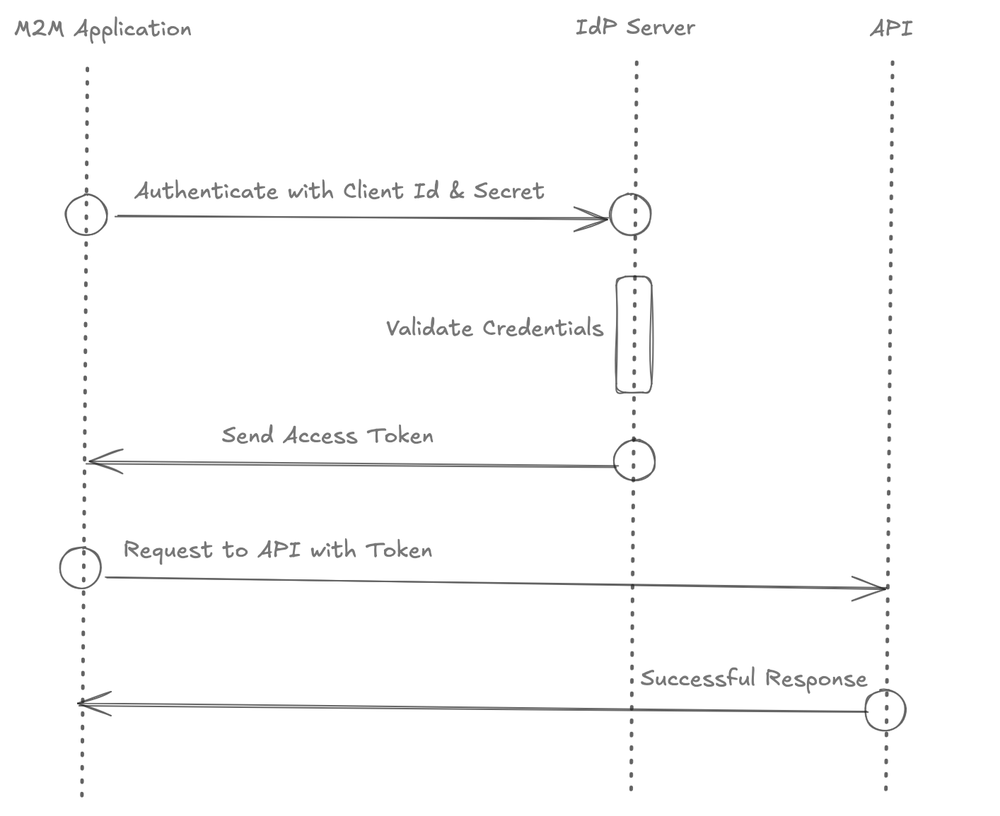

# OpenIdP

This is a personal project to understand how to implement identity provider server for Oauth2.0.

## Client Credentials Flow

The [client credentials flow](https://datatracker.ietf.org/doc/html/rfc6749#section-4.4) is used for machine-to-machine authentication.
The application uses a client id and client secret to get an access token with which the
application can access the protected resources.

